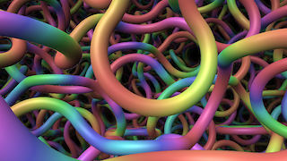

# RainbowSpaghetti

Based on '_[rainbow spaghetti](https://www.shadertoy.com/view/lsjGRV)_' by [mattz](https://www.shadertoy.com/user/mattz) and ported by [nmbr73](../../Site/Profiles/nmbr73.md).

:construction: ***ADD SOME REASONABLE DESCRIPTION HERE!*** Space-filling Truchet tiling using a combination of octahedra and tetrahedra. Press 'g' to toggle drawing the cell grid. :construction:

## Compatibility
- [ ] Tested on macOS/Metal
- [ ] Tested on macOS/OpenCL
- [ ] Tested on Windows/Cuda
- [ ] Tested on Windows/OpenCL
