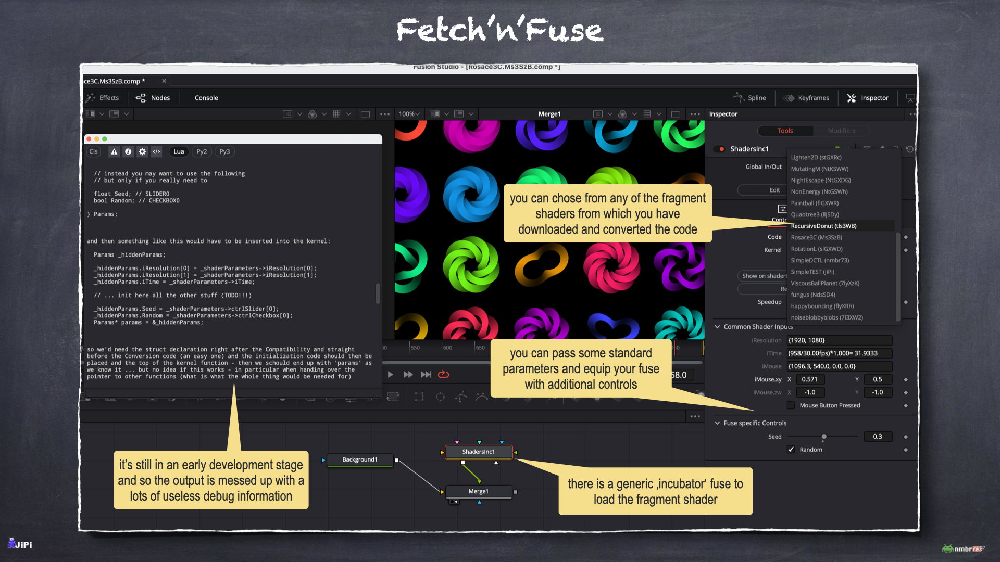

*If you have no idea what all the following is about, then you should start with the [Shadertoys](https://github.com/nmbr73/Shadertoys) repository, to which this one  is only a companion project.*

# Fetch'n'Fuse

The idea is to **Fetch a Shader** ABC via ...
```
./fetch -id ABC
```
... then use the "Incubator.fuse" to **Convert the Code** until it runs smoothly, to then do a
```
./fuse -id ABC
```
... to finally **Make it a Fuse** that - after some **Postprocessing** - we would love to see your **Pull Request on Shadertoys** for.


## Project Status

The `fetch` does fetch some code and the Incubator.fuse is able to show the shader. The `fuse` command does also produce some usable output already. But all the (itermediate) results always need a lot of care and manual rework!

> **You see:** The whole thing is obviously in a very early stage and will probably not work all too well! So be kind, have some patience and most importantly: use at your very own risk!


## Known Limitations

The pre-conversion is very basic (not a C parser, but just some simple regex string substitutions) and does some wrong text replacements - but still it's better then doing it all by hand.

The `fetch` command does work only for shaders that had been marked by their authors for API publication - and it seems that quite a lot of shaders are restricted in this regard :worried:


## Setup

* Drag'n'drop the `install.lua` onto your Fusion composition pane
* Restart Fusion resp. DaVinci Resolve

> **Note:** Whenever you move the repository, get updates on the files within the `.clobber/` folder - or just from time to time - do a drag and drop of the install.lua to be equipped with a fresh version of this fuse. Alternatively (and given your `.env` does define the needed pathes) you can run the `install.py` from within the repository's folder.

Then `cd` into your working copy of the repository and do a ...
```
python3 -m venv .venv
source .venv/bin/activate
python3 -m pip install -r requirements.txt
chmod a+x fetch.py fuse.py
./fetch
```
... on Windows the following could work in a PowerShell:
```
python.exe -m venv .venv
.venv/Scripts/activate.bat
python.exe -m pip install -r requirements.txt
python.exe .\fetch.py
```


Now edit the `.env` file to add you credentials (you need to log in to shadertoys.com and create an APP on https://www.shadertoy.com/myapps to retrieve your own API-Key).

It should look something like this afterwards (Fusion on macOS):
```ini
AUTHOR="nmbr73"
APIKEY="******"
DOWNLOADS="/Users/nmbr73/Downloads/"
FUSEPATH="/Users/nmbr73/Library/Application Support/Blackmagic Design/Fusion/Fuses/"
REPOPATH="/Users/nmbr73/Projects/Fetch-n-Fuse/"
```

... or this (DaVinci Resolve on Windows):
```ini
AUTHOR=nmbr73
USER=peterlustig # windows user folder name 
APIKEY=Bd8KM8 # your shadertoys.com API key
DOWNLOADS=C:\Users\${USER}\Downloads\
FUSEPATH=C:\Users\${USER}\AppData\Roaming\Blackmagic Design\DaVinci Resolve\Support\Fusion\Fuses\
REPOPATH=C:\Users\${USER}\Projects\Fetch-n-Fuse\
```

... `DOWNLOADS` is optional, but it's recommended to set it to your browsers download folder (do not forget the trailing slash!). If set, then the downloads folder is used to search for shaders - otherwise you have to copy such downloads into the `Conversions/` folder before calling `fetch`.

You should consider to add a new *'Fusion Studio' → 'Preferences...' → 'Global and Default Settings' → 'Path Map'* named '`Fetch-n-Fuse:`' pointing to your working copy of the repository (in the above example that would be '`/Users/nmbr73/Projects/Fetch-n-Fuse/`'). This should help in particular to make sharing compositions easier.

# Make a Fuse

As already mentioned ...

## Fetch a Shader

In your working copy (on some systems as a parameters to `python3` maybe) do a ...
```
./fetch --id <TOYID>
```
... with *&lt;TOYID&gt;* the shadertoy ID as it is used in the URLs. If the shader could be fetched (and regretably it often cannot be retrieved), then a corresponding source file should have been created under `Conversions/`.

## Convert the Code

* Add a 'ShadersInc' Fuse to you composition (type 'SHIFT+Space' and then 'inc')
* This should allow you to load all 'Conversions/*&lt;FUSENAME&gt;*.*&lt;TOYID&gt;*.c' files.

And then the fun begins of porting WebGL to DCTL and eliminating all the errors raised when DaFusion tries to render the node.

## Make it a Fuse

As soon as your conversion works without errors, is equipped with some nice controls and leads to the expected output, you are ready to do a ...
```
./fuse --id <TOYID>
```
... which should create a fuse and a markdown file in the `Converted/` folder.

## Postprocessing

:construction:
...

## Pull Request on [Shadertoys](https://github.com/nmbr73/Shadertoys)

:construction:
...

# Impressions

What this looks like ...



*Worth to mention that the [rosace 3c](https://www.shadertoy.com/view/Ms3SzB) in the screenshot was created by [Fabrice Neyret](https://www.shadertoy.com/user/FabriceNeyret2) who not only developed some gorgeous fragment shaders, but also is the creator of [SHADERTOY – UNOFFICIAL](https://shadertoyunofficial.wordpress.com), a very helpful source of information!*


# AudioShaderfuse

Shadertoy provides an interface consisting of an image (512*2 pixels). One line contains 512 sampled waveform values belonging to the current frame and the second line contains the FFT values.
This interface can also be implemented in Resolve/Fusion. For this you need the [AudioWaveform.fuse](https://github.com/nmbr73/Fetch-n-Fuse/blob/main/Fuses/AudioWaveform.fuse). This generates the corresponding image from a loaded WAV file. (You can use the Renderstage of Resolve to convert a mp3-File to a Wav-File) The AudioWaveform has a second output for this. This is connected to an AudioShaderfuse.
The following AudioShaderfuses are present in the repo:
- [ShadertoyAudioDisplay](https://github.com/nmbr73/Fetch-n-Fuse/blob/main/Converted/ShadertoyAudioDisplay.fuse)
- [JamSession](https://github.com/nmbr73/Fetch-n-Fuse/blob/main/Converted/JamSession.fuse)
- [ReactiveVoronoi](https://github.com/nmbr73/Fetch-n-Fuse/blob/main/Converted/ReactiveVoronoi.fuse)
- [AudioHeightfield1](https://github.com/nmbr73/Fetch-n-Fuse/blob/main/Converted/AudioHeightfield1.fuse)
- [AudioWaveformVisualizer](https://github.com/nmbr73/Fetch-n-Fuse/blob/main/Converted/AudioWaveformVisualizer.fuse)

An example comp file is here: [AudioShaderfuse.comp](https://github.com/nmbr73/Fetch-n-Fuse/blob/main/Conversions/AudioShaderfuse.comp)